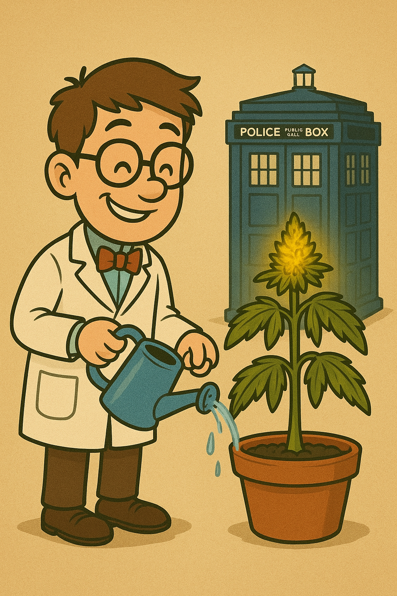

+++
title = "Reconstitution: recreate Grandmas success"
slug = "reconstitution-in-event-sourcing"
date = 2025-11-01T11:00:00Z
authors = ["Patrick Heller"]
+++

My plant died from neglect while Grandma's thrived. Learn how reconstituting state from events lets you replay history and understand success.

<!-- more -->

# Growing Marijuana with Event‑Sourcing — Reconstitution

## Understanding success through reconstitution



After `myPlant` died, I stared at Grandma's notebook filled with her meticulous event log. Every watering, every trimming—all timestamped, all recorded.

"What if," I thought, "I could replay her events and see exactly how her plant thrived?"

This process of rebuilding state by replaying events is called **reconstitution**.

## Starting the experiment

First, let me load Grandma's complete event stream:

{{ file_contents(path="content/blog/event-sourced-marijuana/01-events/grandmasPlant.ts", language="typescript") }}

Now I need a way to track the state as I replay Grandma's actions. Let me build a reconstitution function:


```typescript
interface PlantState {
  id: string;
  isAlive: boolean;
  totalWaterings: number;
  totalTrimCount: number;
}

function reconstitute(events: PlantEvent[]): PlantState {
  const state: PlantState = {
    id: "",
    isAlive: false,
    totalWaterings: 0,
    totalTrimCount: 0
  };

  // Replay each event in order
  for (const event of events) {
    switch (event.type) {
      case "Seeded":
        state.id = event.plantId;
        state.isAlive = true;
        break;

      case "Watered":
        state.totalWaterings += 1;
        break;

      case "Trimmed":
        state.totalTrimCount += 1;
        break;

      case "Died":
        state.isAlive = false;
        break;
    }
  }

  return state;
}
```

Now I can replay any sequence of events and see what state emerges.

## Time travel: comparing different points in time

Now let me compare Grandma's plant at two different points in time—after the first week versus at the end of the month:

<div id="reconstitution-comparison" class="grid grid-cols-1 lg:grid-cols-2 gap-4 lg:gap-8 lg:w-[calc(100vw-4rem)] lg:max-w-[120rem] lg:relative lg:left-1/2 lg:-translate-x-1/2 lg:px-8">
<div class="lg:p-6 lg:flex lg:flex-col lg:items-end">

```typescript
const firstWeek = grandmasPlantEvents.slice(0, 8);

console.log(reconstitute(firstWeek));
// {
//   id: "grandmasPlant",
//   isAlive: true,
//   totalWaterings: 7,
//   totalTrimCount: 0
// }
// After 1 week: 7 waterings, 0 trims
// Early growth phase
```

</div>
<div class="lg:p-6 lg:flex lg:flex-col lg:items-start">

```typescript
const fullMonth = grandmasPlantEvents;

console.log(reconstitute(fullMonth));
// {
//   id: "grandmasPlant",
//   isAlive: true,
//   totalWaterings: 27,
//   totalTrimCount: 4
// }
// After 1 month: 27 waterings, 4 trims
// Mature, healthy plant
```

</div>
</div>

This is the power of reconstitution: I can "time travel" to any point in Grandma's event stream and see exactly what the plant's state was at that moment. With CRUD, I could only see the final state. With Event Sourcing, I can replay history and understand the complete journey from seedling to mature plant.

## Summary

Reconstitution is the process of rebuilding state by replaying events in order:

1. **Start with empty state** - No assumptions, just a blank slate
2. **Replay each event** - Apply events one by one in chronological order
3. **Build up state** - Each event modifies state deterministically
4. **Stop at any point** - Can reconstitute state at *any* moment in history

This enables powerful capabilities that CRUD cannot provide:

- **Time travel:** See what the state was at any point in the past
- **Reproducibility:** Replay the same events, get the same state every time
- **Experimentation:** "What if I had done what Grandma did?"
- **Debugging:** Understand exactly how we reached the current state

In Part 1, we learned that events answer "How did we get here?" In Part 2, we learned that reconstitution answers "What if I could do it again?"

**Next:** Reconstitution is pure and deterministic—no validation, just state building. But what happens when we want to *create new events*? How do we prevent invalid operations like watering a dead plant? That's where aggregates and business rules come in.
